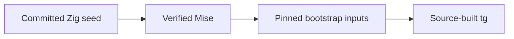

# Universe

Universe is a personal development platform for polyglot projects. Its current
implementation is a verified bootstrap for building Tangram from pinned source.



Mise provisions the bootstrap and optional repository development tools. Tangram
is the intended owner of project toolchains and build execution. The project
toolchain recipes and semantic build analysis are still future work.

This is a binary-assisted source bootstrap. It still trusts binary compilers,
runtimes, SDKs, and platform inputs; it is not a full-source or fully hermetic
build. See [architecture and decisions](docs/architecture.md) for the boundary
and the longer-term direction.

## Get started

From the repository root, on a configured host:

```sh
bin/seed.sh
bin/mise trust
bin/mise install
bin/mise run build-tangram
bin/tg --version
```

The committed seeds let a new machine install Mise without Zig. Building Tangram
requires additional host prerequisites; read the [bootstrap guide](BOOTSTRAP.md)
before starting. Subsequent builds can reuse the verified source copy and Cargo
build cache.

## Platform scope

| Host | Shipped seed | Tangram bootstrap configuration |
| --- | --- | --- |
| macOS ARM64 | Yes | macOS 26.0 deployment target; local build and CLI startup observed |
| macOS x86-64 | Yes | Not configured |
| Linux ARM64 | Yes, musl | Configured for a GNU host; guest build and CLI startup observed |
| Linux x86-64 | Yes, musl | Configured for a GNU host; manual VM test available |

Seed availability, configured build inputs, and successful runtime validation
are different guarantees. The Linux seed's musl target does not make the Tangram
output a musl binary. See the [Tangram package](packages/tangram/README.md) and
[Linux test runner](packages/linux-bootstrap/README.md) for dated evidence and
validation limits.

## Repository map

| Path | Responsibility |
| --- | --- |
| [apps/](apps/README.md) | Applications with executable interfaces |
| [apps/seed/](apps/seed/README.md) | Zig seed implementation, builds, and tests |
| [packages/](packages/README.md) | Reusable packages and upstream integration |
| [packages/tangram/](packages/tangram/README.md) | Tangram source-build adapter |
| [packages/mise-apple-sdk/](packages/mise-apple-sdk/README.md) | Verified Apple SDK plugin |
| [packages/linux-bootstrap/](packages/linux-bootstrap/README.md) | Disposable Linux bootstrap tests |
| [bin/](bin/README.md) | Shipped seed entry points and local installed binaries |
| [tests/](tests/README.md) | Cross-component validation and quality workflow |
| [seed.zon](seed.zon) | Mise release identity, URL template, and hashes |
| [mise.toml](mise.toml) | Bootstrap tools, Tangram inputs, build and cleanup tasks |
| [mise.dev.toml](mise.dev.toml) | Development tools and quality task graph |

## Development

Install development tools and activate the local Git hook:

```sh
bin/mise -E dev install
bin/mise -E dev run install-commitlint
bin/mise -E dev exec -- prek install
bin/mise -E dev exec -- prek run --all-files
```

Use `bin/mise -E dev run check` for lint, formatting checks, and ordinary
tests without invoking prek. Seed artifact comparison and real Linux VM builds
are separate checks. The [test guide](tests/README.md) lists each command and
what it verifies. [AGENTS.md](AGENTS.md) records repository working conventions.

The [quality workflow](.github/workflows/quality.yml) runs these checks and
compares all four shipped seed binaries on macOS ARM64 for pull requests and
pushes to `main`. Real Tangram builds remain separate manual validation.

Commit messages use [Conventional Commits](tests/README.md#commit-messages),
enforced by the installed `commit-msg` hook.

## License

Universe's own code is distributed under the [MIT license](LICENSE). Downloaded
upstream projects, tools, and SDKs retain their own licenses.
