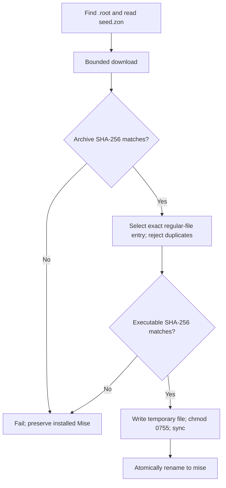

# Bootstrap seed

The seed installs the repository's pinned Mise executable. Its Zig source,
build graph, and tests live here; the shell entry point and four release
executables live in [bin](../../bin/README.md). A new machine uses those
committed executables without installing Zig first.

## Run the seed

From the repository root:

```sh
bin/seed.sh
```

The wrapper selects a binary using the host operating system and architecture,
then forwards the arguments. The supported seed targets are macOS ARM64 and
x86-64, and Linux ARM64 and x86-64. Linux executables use the musl ABI. These
targets describe the seed; Tangram's build support is documented separately in
the [bootstrap guide](../../BOOTSTRAP.md).

The executable searches upward from the current working directory for the
repository's [.root](../../.root) marker, then reads [seed.zon](../../seed.zon)
there. Run it from the repository or a descendant directory. An absolute path
to the wrapper does not change the directory used for root discovery.

With no argument, the destination is `bin/mise` under the discovered root.
The first argument instead names a destination directory. Relative destinations
are resolved from the invocation directory; absolute destinations are used
directly. The installed file is always named `mise`.

```sh
bin/seed.sh .build/custom-tools
```

There is no option parser: `--help`, `--version`, and `--` are interpreted as
destination names when given as the first argument. Further arguments are
ignored by the executable. The wrapper forwards them without changing their
boundaries.

An existing installation does not skip work. Each invocation that reaches the
download stage downloads and verifies Mise again, then replaces the destination
executable. The seed installs Mise but does not execute it. Continue with the
[bootstrap procedure](../../BOOTSTRAP.md) to install toolchains and build
Tangram.

## Manifest and installation contract

`seed.zon` is the authority for the Mise version, download URL pattern, and
archive and executable SHA-256 hashes for all four platforms. The executable's
`Lock` type defines its structure. The `{v}` and `{p}` URL placeholders expand
to the manifest version and compiled platform. The manifest is read at runtime;
changing a Mise release pin does not embed a new pin in the seed binaries.

HTTP, SHA-256, and gzip/tar processing use Zig's standard library. Network
installation needs access to the release service and a usable host certificate
store. The client allows up to three redirects and requires an HTTP 200 final
response. It accepts identity, gzip, and deflate HTTP content encodings and
rejects unsupported encodings.

The downloaded archive stays in memory. Its 256 MiB limit applies after HTTP
content decoding, including chunked responses. One byte of lookahead permits an
archive exactly at the limit and rejects a larger body. The archive hash is
verified before its gzip/tar contents are read.

Extraction reads only the exact regular-file entry `mise/bin/mise`. A missing
entry, duplicate entry, or non-regular entry with that name fails. Archive paths
are never extracted onto the filesystem. The selected executable has a separate
256 MiB limit. These are input and allocation bounds, not a 256 MiB bound on
total process memory: the archive and extracted executable coexist during
extraction, and allocator growth can require additional memory.

The archive is freed after extraction. The executable hash is verified before
creating the destination directory or writing the replacement. The seed writes
a temporary file, sets mode `0755`, syncs the file, and atomically renames it to
`mise`. Repeated runs repair the executable's permissions. An existing `mise`
symlink is replaced without reading or modifying its target; this applies to
the final file, not to symlinks in the destination directory path.

Hash failures preserve an existing executable. Publication gives atomic
visibility of the complete replacement, but does not guarantee crash durability
of the containing directory.

The installation sequence keeps unverified bytes away from the destination:



## Build ownership and release artifacts

[build.zig](build.zig) owns target selection, compilation, formatting, linting,
native tests, stripping, artifact comparison, and publication into `bin`.
[publication.zig](publication.zig) prepares and replaces release artifacts.

Compiler and development-tool pins live in [mise.dev.toml](../../mise.dev.toml).
The linter dependency is pinned in [build.zig.zon](build.zig.zon). Install the
development environment and check the seed before publishing rebuilt artifacts:

```sh
bin/mise -E dev install
bin/mise -E dev run check-seed
bin/mise -E dev run build-seed
bin/mise -E dev run check-seed-artifacts
```

`build-seed` replaces the four tracked executables. Rebuild them after changing
the seed implementation, compiler, or release build configuration, and include
the resulting artifacts with the source change. `check-seed-artifacts` rebuilds
and compares each result byte for byte with `bin`; it writes build caches but
does not replace the tracked binaries. It runs separately from the repository's
ordinary `check` task.

Release builds use ReleaseSmall, single-threaded code, stripped symbols, and no
unwind tables. Linux releases also use full link-time optimization. macOS
releases run `llvm-strip` to remove retained local symbols while preserving
dynamic imports and the ARM64 signature. The default configuration with `dev`
provides that tool on configured bootstrap hosts. Native Debug and ReleaseSafe
checks retain debug information and do not require stripping.

The `zig build publish` step depends on all four completed build artifacts.
It validates executable candidates and prepares all replacement files before
publishing any. Zig owns compilation and its cache; publication owns only its
temporary replacement files. Each replacement is atomic; replacing all four
files is not one transaction. Abrupt process termination can leave temporary
files in `bin`; ordinary errors release pending replacements.

Zig caches, output directories, and downloaded dependencies are ignored. Use
the repository's cleanup tasks only after builds have stopped; see
[BOOTSTRAP.md](../../BOOTSTRAP.md).

## Checks and their scope

The native suite in [main.zig](main.zig) checks the actual repository manifest,
root discovery, hashing, archive selection, allocation failures, destination
replacement, symlinks, and repeated installation. A loopback HTTP fixture covers
redirects, content decoding, response limits, and installation from a local
manifest. These tests do not download or execute a live Mise release, and do
not establish external TLS or release-service compatibility.

From the repository root, run individual checks with:

```sh
bin/mise -E dev run test-seed
bin/mise -E dev run test-seed-binary
bin/mise -E dev run test-seed-build
bin/mise -E dev run test-seed-dispatch
```

- `test-seed` runs native tests in Debug and ReleaseSafe. `check-seed` adds
  formatting, the pinned linter rules, and executable compiler diagnostics.
- [tests/binary.zig](tests/binary.zig) runs the committed native executable
  against a malformed manifest and checks failure before network access or
  installation.
- [publication.zig](publication.zig) tests missing and invalid candidates,
  preparation failures, cleanup, repeated publication, and symlink replacement
  against disposable files. Compilation dependencies prevent publication when
  a release producer fails.
- [tests/dispatch.sh](tests/dispatch.sh) substitutes host detection and
  executable fixtures to check platform selection, argument forwarding, and
  absolute, relative, and PATH invocation of the wrapper.

Cross-compilation and byte comparison do not prove execution on every target.
The binary smoke check runs only the current host's committed executable.

The native suite includes 1,000 deterministic randomized replacement cases
checked against an independent bytewise reference. It also has a fuzz entry
point. With the current compiler pin, the dedicated `zig build test --fuzz=1000`
invocation has a known compile failure in Zig's test runner due to incompatible
stack-trace types. That invocation is not a passing fuzz run. Revisit it after a
compatible compiler fix; do not patch the installed compiler or disable runtime
safety to bypass it. The fuzz limit counts iterations, not seconds.
