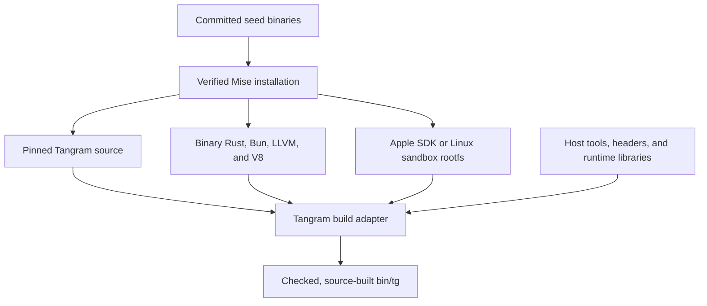

# Architecture

Universe is a personal development platform for projects across languages and
toolchains. Its long-term goal is to develop, test, configure, and release those
projects from one repository. The current implementation establishes the
bootstrap and its development checks; it does not yet implement that full
platform.

## Repository units

Organize owned code by purpose, with flat repository units:

```text
apps/<name>/
packages/<name>/
```

An app exposes an execution contract. A package provides a reusable capability.
An app can keep its private modules alongside its entrypoint. Colocate languages
when they implement the same capability; language-specific directories are
appropriate inside a unit when they express a real toolchain or binding
boundary.

Flatness applies to repository units, not to their internal source trees. Avoid
additional project or category levels between `apps` or `packages` and the unit.
Detailed naming conventions remain open. Publication and versioning are separate
decisions from a unit's directory.

Root files configure and document the repository. Root `tests` covers shared
bootstrap and tooling contracts. Root `bin` holds executable distributions and
installed tools; build scripts and their focused tests live with their owner.

## Current bootstrap



The [seed](../apps/seed/README.md) installs Mise after verifying both its
archive and executable. The [Tangram adapter](../packages/tangram/README.md)
builds a writable copy of the pinned upstream source and publishes a checked
executable. The [bootstrap guide](../BOOTSTRAP.md) gives the operating
procedure.

This is a binary-assisted source bootstrap. It still trusts downloaded compiler,
runtime, SDK, and sandbox inputs, plus host services and tools. Building Tangram
from source does not prove that its toolchain was built from source, that every
input is hermetic, or that every supported platform has passed an execution
test.

## Ownership boundaries

| Concern | Owner |
| --- | --- |
| Mise archive identity and installation | `seed.zon` and `apps/seed` |
| Seed targets, compilation, publication, and artifact comparison | Zig build graph |
| Bootstrap inputs and repository development checks | Mise configuration |
| Apple SDK identity and verified installation | `packages/mise-apple-sdk` |
| Tangram source copy, build lock, and publication | `packages/tangram` |
| Disposable Linux compilation environment | `packages/linux-bootstrap` |
| Future project toolchains and build execution | Tangram |

Mise supplies the tools needed to obtain and build Tangram, and the tools needed
to maintain this repository. Project toolchains belong in the future Tangram
build graph. Keep exact input versions and hashes in their owning manifests;
documentation links to those authorities.

The seed selector uses POSIX shell and runs before Mise or another language
runtime is available. Zig owns seed compilation and publication. Bash owns
the Tangram build lifecycle and external-process integration fixtures. Bun is
provisioned for upstream Tangram's JavaScript build; it does not own repository
orchestration. Mise supplies task configuration and Cargo owns compilation.
The remaining adapters coordinate source copies, locks, validation, and cleanup.

## Planned and exploratory work

The following directions are not implemented repository capabilities:

- **Project build adapters.** Use native manifests and compiler dependency
  information to construct Tangram commands with explicit inputs and outputs.
  Choose units of work that the toolchain actually supports. A compiler's
  internal incremental state is not automatically an externally executable build
  action.
- **Optional source discovery.** Explore Tree-sitter for fast syntax discovery
  and queries where useful. Language toolchains remain authoritative for macro
  expansion, conditional compilation, and other build semantics. Cross-language
  edges require explicit adapter rules or contracts.
- **Incremental analysis.** Evaluate the cost of graph analysis before adding a
  separate incremental engine such as DICE. Tangram command caching and analysis
  caching are distinct concerns.
- **Self-hosting and full-source bootstrap.** The proposed next milestone is a
  declared Tangram self-build, followed by a second build using the produced
  executable with isolated server state. Validate the build and its dependency
  visibility before adopting the replacement. Then reduce trusted binary inputs
  through source-built tools, LLVM, and Rust. Fine-grained action visibility and
  source-built compilers are separate requirements; neither proves the other.
  The accepted bootstrap work stopped before LLVM source compilation.
- **System configuration and dependency integration.** Nix system/user
  configuration, a Nix closure bridge, Snix experiments, and a repository lock
  coordinator were explored. None is implemented or required by this bootstrap.
- **Release and infrastructure.** Publication, deployment, infrastructure state,
  and their tooling remain future decisions.

Earlier Nix/Bazel bootstrap proposals informed the research. The implemented
path now leads through Mise to Tangram. Revisit alternatives against a concrete
project and measured requirements rather than treating research sketches as
established interfaces.
