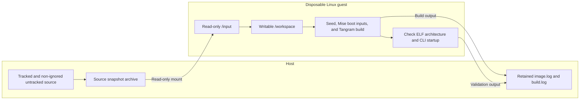

# Linux bootstrap compilation test

This package exercises the [Tangram bootstrap](../tangram/README.md) in a
disposable Linux VM. First follow the
[bootstrap procedure](../../BOOTSTRAP.md) and install development tools:

```sh
bin/mise -E dev install
```

Run from the repository root on Apple silicon with the Mise-provisioned
`container` service running:

```sh
bin/mise -E dev run test-linux-arm64
bin/mise -E dev run test-linux-x64
```

The x64 task enables Rosetta. These are manual integration tasks and are not
part of the ordinary `check` task. Each creates a disposable guest workspace,
installs the default bootstrap inputs, compiles Tangram, and checks ELF metadata
and CLI startup. They do not yet test Tangram sandbox execution.

The host uses the `dev` environment for the container CLI. Inside the
guest, the default configuration supplies only Tangram build inputs;
development tools are not installed.

`Containerfile` owns the base image and Linux system dependencies. Its Ubuntu
24.04 multi-platform image is pinned by digest. Apt packages still come from
Ubuntu's current signed repositories; the complete environment is not hermetic.
Clang and LLD come from Mise. Ubuntu supplies libc, headers, and GCC runtime
libraries, but no GCC compiler is installed.

`run.sh` owns image creation and invocation. It snapshots existing tracked and
non-ignored untracked files, excluding deleted files and ignored build outputs.
Only that snapshot is mounted, read-only, into `/input`. `test.sh` extracts it
into `/workspace`, creates a guest Git root, and runs the bootstrap. Guest
Mise installations and build caches disappear when the container exits. Host
`bin/mise`, `bin/tg`, and caches are never mounted writable.



The test defaults to eight CPUs and 16 GiB of guest memory. Override those with
`LINUX_TEST_CPUS` and `LINUX_TEST_MEMORY`. Image and build logs are retained in
`.build/linux-bootstrap/run-<architecture>.*`. The source archive and temporary
image tag are removed after the run. Apple's builder and downloaded base layers
remain cached by `container`.

Use a service started from the same installation as the CLI. If no containers
are running, restart an older service with:

```sh
bin/mise -E dev exec -- container system stop
bin/mise -E dev exec -- container system start --enable-kernel-install \
  --install-root "$(bin/mise -E dev where aqua:apple/container)/Payload"
```

The VM kernel, init image, and builder image are additional inputs managed by
Apple's container service. They are not pinned by this package yet.

## Runner fixtures and validation limits

Run the inexpensive runner fixtures without starting a VM:

```sh
bin/mise -E dev run test-linux-runner
```

[`tests/run.sh`](tests/run.sh) substitutes the container CLI while executing
the real host runner. It checks snapshot inclusion of untracked files,
exclusion of deleted and ignored artifacts, paths with spaces, platform and
Rosetta selection, read-only mounts, guest failure propagation, and cleanup.
This fixture task is included in the ordinary repository `check` task.

The fixture does not build the image, install the guest toolchain, or compile
Tangram. A real run succeeds only after the guest checks the expected ELF
architecture and runs `bin/tg --version`. These checks establish compilation
and CLI startup for that run; they do not test Tangram sandbox execution or
establish support for every host or guest configuration.

On 2026-09-07, the ARM64 guest run recorded in
`.build/linux-bootstrap/run-arm64.4JF9pS/build.log` completed release
compilation, reported an ARM64 dynamic ELF executable, and passed CLI startup.
This is a historical result for that source snapshot; it does not verify later
changes. Logs remain local and ignored. No x64 compilation success or Tangram
sandboxed workload is established by that run.

Retain and inspect each run's `image.log` and `build.log` before reporting
success. The [repository checks](../../tests/README.md) describe the other
fixture suites and the separate seed artifact comparison.
