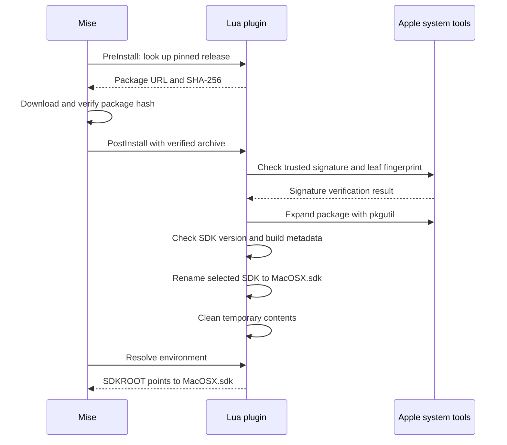

# Apple SDK Mise plugin

This package provisions a pinned macOS SDK from Apple's Software Update CDN.
All plugin logic is Lua interpreted directly by Mise; no build step or Tangram
installation is needed. It does not install Xcode, Command Line Tools,
compilers, or linkers, and does not run package installation scripts.

The root [`mise.toml`](../../mise.toml) registers this local tool plugin. After
the [bootstrap procedure](../../BOOTSTRAP.md) installs `bin/mise`, run from the
repository root to install and use one verified release explicitly:

```sh
bin/mise install apple-sdk@15.5-24F74
bin/mise exec apple-sdk@15.5-24F74 -- your-build-command
```

The environment hook sets `SDKROOT` to the installation's `MacOSX.sdk`.
Consumers must pass this path explicitly as their sysroot. This plugin does not
set a deployment target or fall back to an SDK discovered by `xcrun`.

The root [`mise.toml`](../../mise.toml) selects this SDK for macOS
bootstrap builds:

```toml
[tools]
apple-sdk = { version = "15.5-24F74", os = ["macos"] }
```

Use `bin/mise exec -- your-build-command` to activate it together with
the bootstrap build tools. Linux hosts skip the SDK entry.

## Release identity and installation

`releases.lua` exposes an ordered `list` of typed `Release` records and a
`find(version)` lookup that rejects unknown releases. Each record contains the
SDK version/build, original Apple URL, package SHA-256, signer certificate
SHA-256, package identifiers, and exact payload path. `PreInstall` supplies the
URL and SHA-256 to Mise, which downloads and verifies the archive before calling
`PostInstall`. The post-install hook requires `pkgutil` to report trusted Apple
Software, and checks the leaf certificate fingerprint before expansion. A
package rejected by `pkgutil` or a different leaf fingerprint fails
installation. Trust and certificate-validity evaluation follow `pkgutil`;
leaf certificate changes require review of a new release record.

The installer uses `pkgutil --expand-full`, checks SDK version/build metadata,
and renames the selected SDK directory to `MacOSX.sdk` within
Mise's installation directory. Temporary contents are removed on success or
failure; Mise owns the surrounding tool installation lifecycle. Abrupt process
termination can leave a temporary staging directory. Publishing the SDK is an
atomic Lua `os.rename`; crash durability is not guaranteed. Cleanup uses Mise's
file listing/metadata API and Lua's `os.remove`, without following SDK symlinks.
Download transport, retries, and redirects follow Mise's native HTTP behavior.

The package hash pins the original archive. Extraction relies on macOS's
`pkgutil`; this plugin does not independently hash or audit the extracted tree.
Tangram can assign the directory its content identity when importing the SDK.

The release manifest provides artifact integrity independently of `mise.lock`.
Pin the Universe revision to pin the local plugin implementation and manifest.
These checks authenticate Apple's binary SDK; they do not establish a build
from source.

Verification crosses Mise and Apple tooling before the plugin publishes the SDK:



The sequence shows successful installation. A failed verification stops
publication; ordinary failures also attempt cleanup while preserving the
primary error.

## Host requirements

Installation supports macOS only. Subprocesses are reserved for Apple-specific
operations with no Lua/Mise counterpart: `pkgutil` for signature verification
and package expansion, and `plutil` for the build number in
`SystemVersion.plist`. The SDK version comes from `SDKSettings.json` through
Mise's JSON API. Mise's command API runs these through the system shell. HTTP,
SHA-256, and installation directories are owned by Mise's standard tool-plugin
lifecycle; file operations use Lua/Mise APIs. Do not introduce subprocesses for
these generic operations. It needs no separately installed Lua, Python, Git, or
compiler. It does not use `sudo`. The package and system-tool compatibility must
be tested for each supported host macOS release.

## Updating and checking

The default configuration pins bootstrap tools in the root `mise.toml`.
The `dev` environment pins quality tools and LuaCATS definitions in
[`mise.dev.toml`](../../mise.dev.toml). From the repository root:

```sh
bin/mise -E dev install
bin/mise -E dev run format-apple-sdk
bin/mise -E dev run check-apple-sdk
bin/mise -E dev run test-apple-sdk
```

`check-apple-sdk` checks formatting, enforces an 80-column Lua source limit,
validates the LuaLS configuration schema, and runs LuaLS diagnostics.
Warnings fail the diagnostics task. Behavior tests are a separate task;
the repository-wide `check` includes both. `format-apple-sdk` rewrites Lua
source. See [repository checks](../../tests/README.md) for the full task graph.
StyLua and LuaLS target Lua 5.1. Their package-local configuration files keep
formatting and editor settings with the Lua source.

StyLua targets 80 columns. The separate `line-length-apple-sdk` task rejects
longer source lines, including strings and comments that StyLua cannot wrap.
Only complete 64-digit hex literals assigned to `sha256` or `signer_sha256`
in `releases.lua` are exempt, so hashes remain easy to copy and compare.
The check counts bytes under the C locale (equivalent to columns for the ASCII
source); upstream definitions are excluded.

Mise sets `MISE_LUA_TYPES` to the installed definitions directory. LuaLS reads
this path directly through `workspace.library` in `.luarc.json`; no generated
link or setup task is needed. The upstream LuaCATS file is pinned by commit and
SHA-256 in `mise.dev.toml`, matching Mise 2026.9.1. Its source is
[`crates/vfox/types/mise-plugin.lua`](https://github.com/jdx/mise/blob/8fe6385de7f73908ab5a6c9789f477a322eda3a5/crates/vfox/types/mise-plugin.lua)
under
[Mise's MIT license](https://github.com/jdx/mise/blob/8fe6385de7f73908ab5a6c9789f477a322eda3a5/crates/vfox/LICENSE).
Update that pin deliberately when changing the bootstrap Mise version.
Definitions are editor inputs only, never loaded by the SDK installer.

For editor support, use this package as the LuaLS workspace so it loads
`.luarc.json`. Launch the language server through the repository's Mise
`dev` environment so it receives `MISE_LUA_TYPES`:

```sh
bin/mise -E dev exec -- lua-language-server
```

Configure the editor's language-server command with an absolute path to
`bin/mise` and the arguments shown above, running in this repository. An editor
launched through the same Mise environment can instead inherit the variable.
Once the tools and definitions are installed, checks work offline. Generated
LuaLS logs are ignored under `.lua-check/`. Existing `types/` links from the
former setup task remain ignored and are no longer needed.

The diagnostic configuration was checked with intentional mistakes: a missing
context field and a non-string argument to `cmd.exec` both failed.

Discover candidate URLs through Apple's Software Update catalog; discovery is
not part of normal installation. Review the package signature and metadata,
calculate the package SHA-256, and add a release record in oldest-first order.
Never replace the artifact behind an existing version/build identity.

```sh
/usr/bin/openssl dgst -sha256 -r /path/to/downloaded/SDK.pkg
bin/mise ls-remote apple-sdk
```

The initial 15.5 / 24F74 package was downloaded, authenticated, extracted, and
installed through Mise 2026.9.1 on the development Mac. The Lua-only plugin
passed a fresh isolated install, repeated installation, and `SDKROOT`
activation. Isolated installs with incorrect package hashes, signer hashes, SDK
versions, and SDK builds failed without publishing an SDK and removed their
staging data. A C compile/link/run smoke check passed with the installed Apple
Clang and an explicit sysroot. This does not test a source-built upstream LLVM
toolchain. A clean macOS VM without Xcode/CLT has not yet been tested.
Installing an SDK alone does not resolve the bootstrap's separate C
compiler/linker dependency.

The former backend used `apple-sdk:macos`; use `apple-sdk` for new installs.
Existing installations under the old name are not migrated or deleted.

References:
[Mise tool plugin API](https://mise.jdx.dev/tool-plugin-development.html),
[Mozilla's Apple SDK acquisition](https://searchfox.org/firefox-main/source/build/docs/toolchains.rst#303).

## Behavior tests

Run `bin/mise -E dev run test-apple-sdk` from the repository root. The
Apple SDK test creates a temporary plugin and executes its assertions inside
Mise's embedded Lua runtime. It checks release lookup, platform rejection,
SDKROOT, signature and metadata failures, publication, symlink-safe cleanup, and
preservation of the primary error when cleanup also fails. Package commands and
filesystem effects are simulated; the test does not download or install an Apple
SDK. The fixture is in [`tests/integration.sh`](tests/integration.sh), with
assertions in [`tests/behavior.lua`](tests/behavior.lua). Passing fixtures do
not establish that a current Apple package, certificate chain, or host macOS
release passes the real installation boundary.

The strict Lua line-length rule lives in
[check-line-length.awk](check-line-length.awk). Mise invokes AWK directly;
complete manifest hash literals are exempt.
