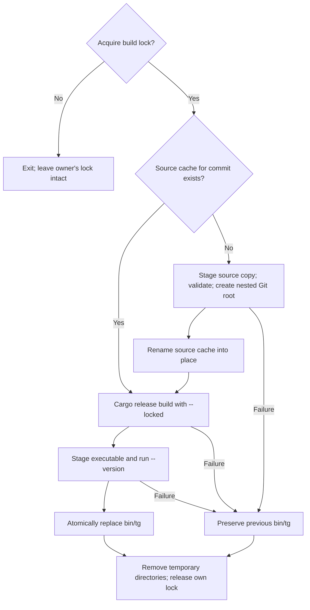

# Tangram bootstrap adapter

This package builds the upstream Tangram CLI from pinned source and publishes it
as `bin/tg`. It owns the writable source copy, build lock, Cargo invocation, and
executable publication. Mise owns input provisioning.

## Build and check

From the repository root, after [installing Mise](../../BOOTSTRAP.md):

```sh
bin/mise install
bin/mise run build-tangram
bin/tg --version
```

For the adapter's fixture tests, install the development environment and run:

```sh
bin/mise -E dev install
bin/mise -E dev run test-tangram-build
```

[The tests](tests/build.sh) replace compilation with fixtures while exercising
source copying, cache identity, rejected hosts, tool validation, paths with
spaces, failed builds, publication, and lock contention. They do not compile
Tangram or prove compiler/runtime compatibility. Full Linux builds use the
separate [Linux bootstrap runner](../linux-bootstrap/README.md).

## Input authorities

Exact versions and archive hashes live in [mise.toml].
The build task passes these inputs to [build.sh](build.sh):

| Input | Contract |
| --- | --- |
| `TANGRAM_SOURCE` | Mise source installation keyed by a full upstream commit |
| Rust and Bun | Bootstrap compiler and upstream JavaScript build runtime |
| `CC`, `CXX`, `AR`, `RANLIB` | Executables from the pinned LLVM installation |
| `TANGRAM_LINKER` | LLD selected for the host object format |
| `RUSTY_V8_ARCHIVE` | Verified static V8 archive matching Cargo inputs |
| `SDKROOT` | Verified Apple SDK on macOS |
| `TANGRAM_SANDBOX_ROOTFS` | Verified Tangram sandbox rootfs on Linux |

Mise verifies the source archive before installation. The adapter requires a
commit-shaped source directory name and copies its contents; it does not verify
a new source digest on every build. Use the task environment to retain the
provisioning contract. Do not edit the Mise installation or use the writable
build cache as the authority for upstream changes.

Keep the V8 archive aligned with Tangram's locked crate version, target, and
features. The Linux archives use the GNU ABI. Linux still supplies system
headers, libc, and compatible runtime libraries. The sandbox rootfs also
contains binary runtime libraries; its programs are not added to the host PATH.

On macOS, the [Apple SDK plugin](../mise-apple-sdk/README.md) activates
`SDKROOT`. The adapter passes it to the linker and selects the pinned LLVM
compiler. The SDK version does not determine the minimum supported macOS
version. The pinned upstream `.cargo/config.toml` sets
`MACOSX_DEPLOYMENT_TARGET = "26.0"`, so this Tangram build targets macOS 26.0
or later. That constraint is separate from the seed executable's platform scope.

The adapter selects Cargo's linker for the native Rust host and passes linker
arguments through `CARGO_ENCODED_RUSTFLAGS`, preserving paths with spaces. It
does not pass Cargo `--target`: host build scripts and procedural macros must
use the same linker configuration.

Cargo supports native linker settings and rustflag arrays, but these paths are
resolved dynamically by Mise. Retain the small environment adapter rather than
generating a second Cargo configuration or weakening argument boundaries. Cargo
installation also does not replace the source-copy and checked `bin/tg`
publication contracts.

## Supported inputs and validation scope

Configured Tangram build hosts are macOS ARM64, Linux ARM64 GNU, and Linux
x86-64 GNU. Other Rust hosts fail before compilation. The seed's four release
targets have a separate support contract; an available seed does not imply a
configured Tangram toolchain for that host.

The validation record reviewed on 2026-09-07 includes a macOS ARM64 release
build completed with
`DEVELOPER_DIR` pointing to a nonexistent directory. Native compiler logs and
C/C++ compile/link/run checks confirmed the pinned LLVM/SDK path, and the CLI
started successfully. This was not a clean machine without Xcode/CLT.

A Linux ARM64 guest run completed compilation, ELF inspection, and CLI startup
on 2026-09-07. Its retained log is
`.build/linux-bootstrap/run-arm64.4JF9pS/build.log` in the development checkout;
logs are ignored and are not part of a fresh clone. These historical runs
precede this documentation checkpoint; fixture tests cover subsequent adapter
changes. Linux x86-64 compilation and a Tangram sandboxed workload have not been
established by those results.

This bootstrap trusts prebuilt Rust, Bun, LLVM, V8, SDK, and sandbox inputs. It
does not build LLVM from source or establish a full-source bootstrap.

## Source cache and lifecycle

The adapter uses `.build/tangram/verified-<commit>` as a writable source cache.
On first use, it copies the Mise source into an invocation-owned temporary
directory, checks for Cargo's manifest and lockfile, initializes a local Git
root, and renames the directory into place. The Git root prevents upstream
oxlint from inheriting Universe's ignore rule for `.build`.

Repeated builds at the same commit reuse this directory and its Cargo target
cache. A different commit gets a different directory. Cargo runs with `--locked`
and builds the release `tangram_cli` package. It can still fetch locked
dependencies; this is not an offline build contract.

A `.build/tangram/.lock` directory excludes concurrent adapter invocations
across source preparation, compilation, and publication. A rejected invocation
does not remove the existing lock. Cargo runs synchronously in a subshell. The
wrapper does not implement separate supervision of Cargo's process tree.

On ordinary exit, the wrapper removes its temporary source/publication
directories and releases its lock. Interrupt and termination traps exit with
status 130 and 143. A forced kill can leave a stale lock. Confirm that the
entire build has stopped before removing that lock or running cleanup.

The lock spans source preparation through publication. The diagram shows
ordinary completion and failure; forced termination can bypass cleanup.



## Publication and recovery

After Cargo succeeds, the adapter copies the candidate into an invocation-owned
directory under `bin`, makes it executable, and runs `--version`. Only a
successful candidate replaces `bin/tg`, through an atomic rename on the same
filesystem. Input, compilation, or candidate validation failure leaves the
previously published CLI available.

To discard the writable source cache and published CLI after builds stop:

```sh
bin/mise run clean-tangram
```

This removes `.build/tangram` and `bin/tg`. It retains Mise's installed inputs.
The next build recreates the writable copy from the verified installation.

[mise.toml]: ../../mise.toml
