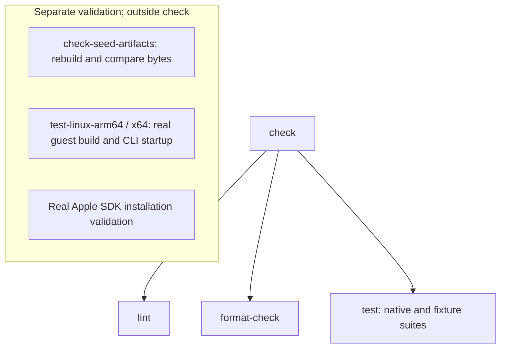

# Repository checks and tests

Mise owns the local quality task graph in [`mise.dev.toml`](../mise.dev.toml).
This directory owns integration tests for repository configuration, cleanup,
and Git hooks. Component tests live beside the component they exercise.

## Install and run

First follow the [bootstrap procedure](../BOOTSTRAP.md) to install `bin/mise`
and trust the repository configuration. From the repository root:

```sh
bin/mise -E dev install
bin/mise -E dev run check
```

The default configuration supplies bootstrap inputs; `dev` adds quality and
development tools. Exact tool versions are pinned in the Mise configuration.
The checks use those tools without separately provisioning another toolchain.

Run a smaller group when working on one concern:

```sh
bin/mise -E dev run lint
bin/mise -E dev run format-check
bin/mise -E dev run test
bin/mise -E dev run format
```

`check` combines lint, formatting checks, and tests. `format` rewrites source;
the other commands do not apply formatting fixes. Checks can create ignored
build caches, LuaLS logs, and disposable test fixtures.



## Quality tools

| Source | Diagnostics or validation | Formatter |
| --- | --- | --- |
| Zig | Compiler and selected `zlinter` rules | `zig fmt` |
| ZON | Zig build manifest and typed seed parser | `zig fmt` |
| Lua | LuaLS and the package line-length check | StyLua |
| Shell | ShellCheck | shfmt |
| GitHub Actions YAML | actionlint, including embedded ShellCheck diagnostics | None |
| TOML | Tombi and native task/config validation | Tombi |
| JSON | Pinned LuaLS configuration schema | Oxfmt |
| Markdown | rumdl | rumdl |

Sourcemeta JSON Schema CLI validates the Apple SDK package's `.luarc.json`.
Other JSON files need a suitable schema or consumer check when introduced.
Tombi treats warnings as errors; LuaLS diagnostics also fail on warnings.
Markdown, Lua, and TOML target 80 columns. Tombi's width is a formatting target;
long URL, path, and hash strings remain intact. Long command strings can wrap
at safe argument boundaries without changing their parsed value.

Shell, TOML, and JSON tasks share source patterns between lint and formatting
where applicable. They have no freshness cache, so every invocation checks the
current files, including matching non-ignored untracked files. Markdown uses
Git ignore rules; Zig and Lua checks are scoped to their components. Downloaded
source trees and generated build output are outside first-party coverage.

Add task coverage when introducing a new source type or moving files beyond
the configured patterns. Short inline Mise commands are checked as task
configuration; substantive shell logic belongs in checked `.sh` files.
The Linux `Containerfile` currently has no dedicated linter or formatter.
Its image build is exercised by the separate manual Linux tasks.

## Test boundaries

The ordinary `test` task runs these suites:

- `test-seed` runs native Zig tests in Debug and ReleaseSafe. It covers the
  checked-in manifest, root discovery, hash validation, bounded HTTP reads,
  archive selection, allocation failures, and atomic installation. The HTTP
  server is local. The tests do not download or execute Mise.
- `test-seed-binary` invokes the committed native seed and checks that a
  malformed manifest fails without installation. It is a narrow CLI check,
  not a successful download/install test.
- `test-seed-build` runs native Zig publication tests for invalid candidates,
  preparation failures, cleanup, and atomic replacement. `test-seed-dispatch`
  tests platform selection,
  invocation paths, and argument forwarding with substitute host binaries.
- `test-tangram-build` tests source identity, retries, locks, tool paths,
  configured host coverage, and publication with simulated compilation.
- `test-bootstrap-mise` resolves the real Mise environment templates against
  disposable installations. `test-bootstrap-cleanup` runs actual cleanup
  tasks against disposable artifacts and verifies that source is retained.
- `test-apple-sdk` runs assertions in Mise's embedded Lua runtime. Package
  commands and filesystem effects are simulated; no SDK is installed.
- `test-prek` installs and runs real Prek hooks in a temporary Git repository.
  It substitutes the task executor and checks order, failure propagation,
  and preservation of partially staged changes. The message hook forwards to
  real commitlint to check conventional messages and reject invalid types.
- `test-linux-runner` uses a substitute container CLI to test source snapshot
  contents, platform selection, read-only mounts, failures, and cleanup.

`test-bootstrap` groups the seed build/dispatch, Tangram build, Mise, and
cleanup suites. Every individual task above is also directly runnable with
`bin/mise -E dev run <task>`.

Find the implementations in [bootstrap](bootstrap/), [tooling](tooling/),
[seed tests](../apps/seed/tests/),
[Tangram tests](../packages/tangram/tests/),
[Apple SDK tests](../packages/mise-apple-sdk/tests/), and
[Linux runner tests](../packages/linux-bootstrap/tests/).

## Local Git hooks

[`prek.toml`](../prek.toml) defines three quality hooks and a separate
`commit-msg` hook. Install them and run the quality checks manually with:

```sh
bin/mise -E dev run install-commitlint
bin/mise -E dev exec -- prek install
bin/mise -E dev exec -- prek run --all-files
```

Quality hooks run lint, format-check, and test in that order, without rewriting
source. They always
run, including for deletion-only changes. Each checks the repository source
sets rather than only the filenames passed by Git. Stage new scripts and
configuration with the change; Prek requires its configuration to be staged
and temporarily hides unstaged tracked changes during commit hooks.

The hook integration test creates a commit only in its disposable repository.
It does not commit or change this repository's index. Hooks are a convenience;
the Mise tasks remain usable directly.

## Commit messages

The message hook runs commitlint with the unmodified
`@commitlint/config-conventional` rules. Root [package.json](../package.json)
pins the direct dependencies, [bun.lock](../bun.lock) pins the dependency
tree, and [.commitlintrc.json](../.commitlintrc.json) selects the config.

The `lint-commit` task installs locked dependencies with lifecycle scripts
disabled and runs commitlint with Bun. Installed `node_modules` stays ignored.
Use Conventional Commits, for example:

```text
feat(seed): verify downloaded tools
fix(tangram): preserve failed build diagnostics
chore: establish bootstrap and quality checks
```

Scopes are optional. The upstream config owns allowed types and other rules;
there are no local overrides. Its default ignored-message behavior, including
merge and revert messages, is preserved. Check a message file manually with:

```sh
bin/mise -E dev run lint-commit -- --edit /path/to/message.txt
```

The hook integration suite tests valid messages, missing types, unsupported
types, and paths containing spaces through a real installed Prek message hook.
These tests run locally and in GitHub Actions as part of `check`; they do not
check historical commits.

## GitHub Actions

The [quality workflow](../.github/workflows/quality.yml) runs on pull requests,
pushes to `main`, and manual dispatch. Its `Quality checks` job uses a macOS
ARM64 runner, installs Mise through the shipped seed, trusts the checkout,
installs the pinned development and bootstrap tools, then runs:

```sh
bin/mise -E dev run check
bin/mise -E dev run check-seed-artifacts
```

Mise owns tool versions and task composition. The workflow owns triggers,
runner selection, a 60-minute timeout, and cancellation of superseded runs.
Actions are pinned to full commit hashes, checkout does not retain Git
credentials, and the job has read-only repository permissions. The GitHub
token is supplied only to the tool installation step for authenticated
downloads.

Pinned `actions/cache` restore/save actions maintain separate tool and Bun
package-download caches. Only successful `main` runs save caches; PRs restore
but do not save. Keys include the OS, architecture, runner image label, and
owning manifests. Tool keys also include the seed manifest and Apple SDK Lua
sources, so changed verification behavior invalidates installed SDKs. There
are no fallback restore keys.

The job isolates Mise installations, Cargo shims, and Rustup state under the
runner temporary directory and caches them together. Bun caches downloaded
packages, not `node_modules`. Installation commands still run on cache hits.
SDK signature verification occurs when installing on a cache miss; a hit
reuses an installation from a successful `main` run.

The seed still downloads and verifies Mise each run. Zig build outputs and
successful test results are not cached between jobs, so both quality commands
continue to execute with fresh build state. Compare cold and warm hosted
runs before claiming a speed improvement; tool archive transfer has a cost.

Run `bin/mise -E dev run lint-workflows` to validate workflow syntax,
expressions, action inputs, and embedded shell commands with actionlint.
This task is part of `lint` and therefore also runs through local hooks.

After publication and the first successful hosted run, configure the `main`
branch rules to require `Quality checks` before merging. The workflow file
alone does not enforce branch protection. Local checks do not establish that
the hosted runner has completed provisioning or passed the workflow.

Provisioning downloads the real Apple SDK and verifies it through the plugin;
the quality job does not compile Tangram or run a sandboxed workload. Full
bootstrap validation remains manual. The existing Apple-container Linux VM
tasks require a local Apple silicon host; GitHub's ARM64 macOS runners do not
support nested virtualization. A future hosted Linux build should use native
Linux runners and the package's declared guest dependencies.

## Separate validation

The ordinary `check` task excludes release artifact comparison and real Linux
VM builds. Rebuild and compare all four seed artifacts without replacing them:

```sh
bin/mise -E dev run check-seed-artifacts
```

This needs the bootstrap LLVM strip tool and writes to Zig's cache. Matching
bytes establish correspondence with this build; cross-compilation does not
prove execution on every architecture.

For real Linux compilation and CLI startup, use the manual tasks described in
the [Linux bootstrap package](../packages/linux-bootstrap/README.md). Fixture
tests do not establish that the VM build or Tangram sandbox execution works.
The Apple SDK package documents its separate
[installation validation](../packages/mise-apple-sdk/README.md).

The seed includes 1,000 deterministic randomized replacement cases and a
native fuzz entry point. The native fuzz command has a documented Zig 0.16.0
test-runner compilation failure; it is not a passing fuzz run. See the
[seed documentation](../apps/seed/README.md) for details. Loopback HTTP fixtures
do not establish external TLS or live release-service compatibility.
